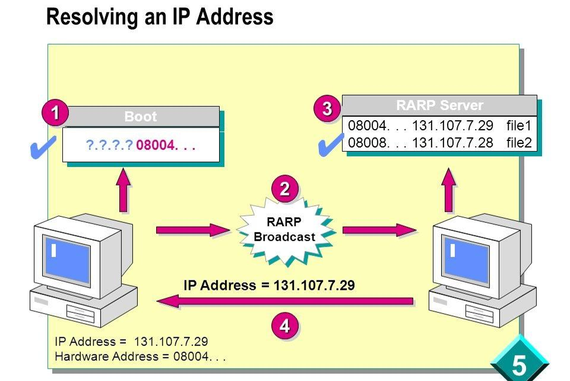
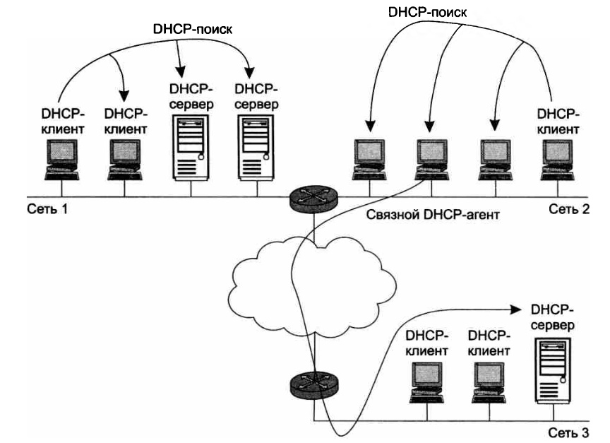

# Конспект протокол DHCP

---

## Назначение IP-адресов

Для нормальной работы сети каждому сетевому интерфейсу компьютера и маршрутизатора должен быть назначен IP-адрес. Процедура присвоения адресов происходит в ходе конфигурирования компьютеров и маршрутизаторов. Назначение IP-адресов может происходить вручную в результате выполнения процедуры конфигурирования интерфейса, для компьютера сводящейся, например, к заполнению системы экранных форм. При этом администратор должен помнить, какие адреса из имеющегося множества он уже использовал для других интерфейсов, а какие еще свободны.

---

## Дополнительные параметры конфигурирования

При конфигурировании помимо IP-адресов сетевых интерфейсов (и соответствующих масок) устройству сообщается ряд других конфигурационных параметров. При конфигурировании администратор должен назначить клиенту не только IP-адрес, но и другие параметры стека TCP/IP, необходимые для его эффективной работы, например маску и IP-адрес маршрутизатора, предлагаемые по умолчанию, IP-адрес DNS-сервера, доменное имя компьютера и т. п. Даже при очень небольшом размере сети эта работа представляет для администратора утомительную процедуру.

---

## Автоматизация конфигурирования

Протокол динамического конфигурирования хостов (Dynamic Host Configuration Protocol, DHCP) автоматизирует процесс конфигурирования сетевых интерфейсов. При этом он гарантирует от дублирования адресов за счет централизованного управления их распределением.

---

##  RARP — первая реализация

Одна из первых реализаций протокола для выдачи IP-адресов появилась более 30 лет назад и называлась RARP (Reverse Address Resolution Protocol). Если немного упростить принцип его работы, то выглядело это так:

- клиент делал запрос на широковещательный адрес сети,
- сервер его принимал, находил в своей базе данных привязку MAC-адреса клиента и IP — и отправлял в ответ IP-адрес.

---

## Диаграмма работы RARP

- Boot → RARP Server → ответ с IP-адресом.
- Пример: MAC 08004... → IP 131.107.7.29, файл file1; MAC 08008... → IP 131.107.7.28, файл file2.
- RARP Broadcast: IP Address = 131.107.7.29, Hardware Address = 08004...

---

## Минусы RARP

И все вроде работало. Но у протокола были минусы:

- нужно было настраивать сервер в каждом сегменте локальной сети,
- регистрировать MAC-адреса на этом сервере,
- а передавать дополнительную информацию клиенту вообще не было возможности.

Поэтому на смену ему был создан протокол BOOTP (Bootstrap Protocol).

---

## BOOTP

Изначально он использовался для бездисковых рабочих станций. Этим станциям нужно было не только выдать IP-адрес, но и передать клиенту дополнительную информацию:

- адрес сервера TFTP,
- имя файла загрузки.

В отличие от RARP, протокол уже поддерживал relay. Relay — небольшие сервисы, которые пересылали запросы «главному» серверу.

---

## Появление DHCP

Это сделало возможным использование одного сервера на несколько сетей одновременно. Вот только оставалась необходимость ручной настройки таблиц и ограничение по размеру для дополнительной информации. Как результат, на сцену вышел современный протокол DHCP. DHCP является совместимым расширением BOOTP. DHCP-сервер поддерживает устаревших клиентов, но не наоборот.

---

## Модель клиент-сервер

Протокол DHCP работает в соответствии с моделью клиент-сервер. Во время старта системы компьютер, являющийся DHCP-клиентом, посылает в сеть широковещательный запрос на получение IP-адреса. DHCP-сервер откликается и посылает сообщение-ответ, содержащее IP-адрес и некоторые другие конфигурационные параметры.

---

## Три режима работы

При этом DHCP-сервер может работать в разных режимах, включая:

- ручное назначение статических адресов;
- автоматическое назначение статических адресов;
- автоматическое распределение динамических адресов.

Во всех режимах работы администратор при конфигурировании DHCP-сервера сообщает ему один или несколько диапазонов IP-адресов, причем все эти адреса относятся к одной сети, то есть имеют одно и то же значение в поле номера сети.

---

## Ручной режим

В ручном режиме администратор помимо пула доступных адресов снабжает DHCP-сервер информацией о жестком соответствии IP-адресов физическим адресам или другим идентификаторам клиентских узлов. DHCP-сервер, пользуясь этой информацией, всегда выдаст определенному DHCP-клиенту один и тот же назначенный ему администратором IP-адрес, а также набор других конфигурационных параметров.

---

## Автоматическое назначение статических адресов

В режиме автоматического назначения статических адресов DHCP-сервер самостоятельно, без вмешательства администратора, произвольным образом выбирает клиенту IP-адрес из пула наличных IP-адресов. Адрес дается клиенту из пула в постоянное пользование, то есть между идентифицирующей информацией клиента и его IP-адресом по-прежнему, как и при ручном назначении, существует постоянное соответствие. Оно устанавливается в момент первого назначения DHCP-сервером IP-адреса клиенту. При всех последующих запросах сервер возвращает клиенту тот же самый IP-адрес.

---

## Динамическое распределение адресов

При динамическом распределении адресов DHCP-сервер выдает адрес клиенту на ограниченное время, называемое сроком аренды. Когда компьютер, являющийся DHCP-клиентом, удаляется из подсети, назначенный ему IP-адрес автоматически освобождается. Когда компьютер подключается к другой подсети, то ему автоматически назначается новый адрес. Ни пользователь, ни сетевой администратор не вмешиваются в этот процесс.

---

## Преимущества динамического распределения

Это дает возможность впоследствии повторно использовать этот IP-адрес для назначения другому компьютеру. Таким образом, помимо основного преимущества DHCP — автоматизации рутинной работы администратора по конфигурированию стека TCP/IP на каждом компьютере, режим динамического распределения адресов в принципе позволяет строить IP-сеть, количество узлов в которой превышает количество имеющихся в распоряжении администратора IP-адресов.

---

## Пример — мобильные сотрудники

Рассмотрим преимущества, которые дает динамическое распределение пула адресов, на примере. Пусть в некоторой организации сотрудники значительную часть рабочего времени проводят вне офиса — дома или в командировках. Каждый из них имеет портативный компьютер, который во время пребывания в офисе подключается к корпоративной IP-сети. Возникает вопрос, сколько IP-адресов необходимо этой организации?

---

## Первый ответ — по числу сотрудников

Первый ответ — столько, скольким сотрудникам необходим доступ в сеть. Если их 500 человек, то каждому из них должен быть назначен IP-адрес и выделено рабочее место. То есть администрация должна получить у поставщика услуг адреса двух сетей класса С и оборудовать соответствующим образом помещение. Однако вспомним, что сотрудники в этой организации редко появляются в офисе, значит, большая часть ресурсов при таком решении будет простаивать.

---

## Второй ответ — по числу присутствующих

Второй ответ — столько, сколько сотрудников обычно присутствует в офисе, естественно, с некоторым запасом. Если обычно в офисе работает не более 50 сотрудников, то достаточно получить у поставщика услуг пул из 64 адресов и установить в рабочем помещении сеть с 64 коннекторами для подключения компьютеров. Но возникает другая проблема — кто и как будет конфигурировать компьютеры, состав которых постоянно меняется?

---

## Два пути решения

Существуют два пути. Во-первых, администратор или сам мобильный пользователь может конфигурировать компьютер вручную каждый раз, когда возникает необходимость подключения к офисной сети. Такой подход требует от администратора или пользователей большого объема рутинной работы, следовательно — это плохое решение. Гораздо привлекательнее выглядят возможности автоматического назначения динамических DHCP-адресов.

---

## Итог примера

Действительно, администратору достаточно один раз при настройке DHCP-сервера указать диапазон из 64 адресов. А каждый вновь прибывающий мобильный пользователь будет просто физически подключать в сеть свой компьютер, на котором запускается DHCP-клиент. Он запросит конфигурационные параметры и автоматически получит их от DHCP-сервера. Таким образом, для работы 500 (пятисот) мобильных сотрудников достаточно иметь в офисной сети 64 IP-адреса и 64 рабочих места.

---

## Параметры DHCP-сервера

Администратор управляет процессом конфигурирования сети, определяя два основных конфигурационных параметра DHCP-сервера:

- пул адресов, доступных распределению,
- срок аренды.

Срок аренды диктует, как долго компьютер может использовать назначенный IP-адрес, перед тем как снова запросить его у DHCP-сервера. Срок аренды зависит от режима работы пользователей сети.

---

##  Примеры срока аренды

Если это небольшая сеть учебного заведения, куда со своими компьютерами приходят многочисленные студенты для выполнения лабораторных работ, то срок аренды может быть равен длительности лабораторной работы. Если же это корпоративная сеть, в которой сотрудники предприятия работают на регулярной основе, то срок аренды может быть достаточно длительным — несколько дней или даже недель.

---

##  Расположение DHCP-сервера

DHCP-сервер должен находиться в одной подсети с клиентами. Нужно учитывать, что клиенты посылают ему широковещательные запросы. Для снижения риска выхода сети из строя из-за отказа DHCP-сервера в сети иногда ставят резервный DHCP-сервер. Такой вариант соответствует сети 1.

---

## Слайд 27. Схема сети с DHCP
**Тема:** Сети 1, 2, 3

- Сеть 1: DHCP-клиенты, два DHCP-сервера, DHCP-поиск.
- Сеть 2: DHCP-клиенты, DHCP-поиск, связной DHCP-агент.
- Сеть 3: DHCP-клиенты, DHCP-сервер.
- Связной агент переправляет запросы из сети 2 DHCP-серверу сети 3.
- Один DHCP-сервер может обслуживать клиентов нескольких разных сетей.

---

## Связной DHCP-агент

Иногда наблюдается и обратная картина: в сети нет ни одного DHCP-сервера. В этом случае его подменяет связной DHCP-агент. Это программное обеспечение, которое играет роль посредника между DHCP-клиентами и DHCP-серверами. Пример такого варианта — сеть 2. Связной агент переправляет запросы клиентов из сети 2 DHCP-серверу сети 3. Таким образом, один DHCP-сервер может обслуживать DHCP-клиентов нескольких разных сетей.

---

## Шаг 1 — DHCP-поиск

Вот как выглядит упрощенная схема обмена сообщениями между клиентскими и серверными частями DHCP.

1. Когда компьютер включают, установленный на нем DHCP-клиент посылает ограниченное широковещательное сообщение DHCP-поиска. Им является IP-пакет с адресом назначения, состоящим из одних единиц, который должен быть доставлен всем узлам данной IP-сети.

## Шаг 2 — получение поиска

2. Находящиеся в сети DHCP-серверы получают это сообщение. Если в сети DHCP-серверы отсутствуют, то сообщение DHCP-поиска получает связной DHCP-агент. Он пересылает это сообщение в другую, возможно, значительно отстоящую от него сеть DHCP-серверу, IP-адрес которого ему заранее известен.

## Шаг 3 — DHCP-предложения

3. Все DHCP-серверы, получившие сообщение DHCP-поиска, посылают DHCP-клиенту, обратившемуся с запросом, свои DHCP-предложения. Каждое предложение содержит IP-адрес и другую конфигурационную информацию. DHCP-сервер, находящийся в другой сети, посылает ответ через DHCP-агента.

##  Шаг 4 — DHCP-запрос

4. DHCP-клиент собирает конфигурационные DHCP-предложения от всех DHCP-серверов. Как правило, он выбирает первое из поступивших предложений и отправляет в сеть широковещательный DHCP-запрос. В этом запросе содержатся идентификационная информация о DHCP-сервере, предложение которого принято, а также значения принятых конфигурационных параметров.

##  Шаги 5–6 — квитанция

5. Все DHCP-серверы получают DHCP-запрос, и только один выбранный DHCP-сервер посылает положительную DHCP-квитанцию, подтверждающую IP-адреса и параметры аренды. А остальные серверы аннулируют свои предложения, в частности возвращают в свои пулы предложенные адреса.

6. DHCP-клиент получает положительную DHCP-квитанцию и переходит в рабочее состояние.

---

## Обновление аренды

Время от времени компьютер пытается обновить параметры аренды у DHCP-сервера. Первую попытку он делает задолго до истечения срока аренды, обращаясь к тому серверу, от которого он получил текущие параметры. Если ответа нет или ответ отрицательный, он через некоторое время снова посылает запрос. Так повторяется несколько раз, и если все попытки получить параметры у того же сервера оказываются безуспешными, клиент обращается к другому серверу.

---

## Потеря параметров

Если и другой сервер отвечает отказом, то клиент теряет свои конфигурационные параметры и переходит в режим автономной работы. Также DHCP-клиент может по своей инициативе досрочно отказаться от выделенных ему параметров. В сети, где адреса назначаются динамически, нельзя быть уверенным в адресе, который в данный момент имеет тот или иной узел. И такое непостоянство IP-адресов влечет за собой некоторые проблемы.

---

## Проблема 1 — DNS

Во-первых, возникают сложности при преобразовании символьного доменного имени в IP-адрес. Действительно, представьте себе функционирование системы DNS, которая должна поддерживать таблицы соответствия символьных имен IP-адресам в условиях, когда последние меняются каждые два часа! Учитывая это обстоятельство, для серверов, к которым пользователи часто обращаются по символьному имени, назначают статические IP-адреса, оставляя динамические только для клиентских компьютеров.

---

## Динамическая DNS

Однако в некоторых сетях количество серверов настолько велико, что их ручное конфигурирование становится слишком обременительным. Это привело к разработке усовершенствованной версии DNS, так называемой динамической системы DNS. В основе этой версии лежит согласование информационной адресной базы в службах DHCP и DNS.

---

## Проблема 2 — мониторинг

Во-вторых, трудно осуществлять удаленное управление и автоматический мониторинг интерфейса, например, сбор статистики, если в качестве его идентификатора выступает динамически изменяемый IP-адрес. Статические адреса позволяют администраторам удаленно управлять устройствами – до них проще получить доступ к устройству, когда они могут легко определить его IP-адрес.

---

## Кому назначают статические адреса

Обычно статические адреса назначают устройствам, которые предоставляют услуги пользователям в сети. Ими могут быть:

- маршрутизаторы,
- серверы,
- принтеры,
- другие сетевые устройства, местоположение которых (физическое и логическое) вряд ли изменится.

Поэтому назначенные им адреса должны оставаться постоянными.

---

## Проблема 3 — фильтрация

Наконец, для обеспечения безопасности сети многие сетевые устройства могут блокировать (фильтровать) пакеты, определенные поля которых имеют некоторые заранее заданные значения. Другими словами, при динамическом назначении адресов усложняется фильтрация пакетов по IP-адресам. Последние две проблемы проще всего решаются отказом от динамического назначения адресов для интерфейсов, фигурирующих в системах мониторинга и безопасности.

